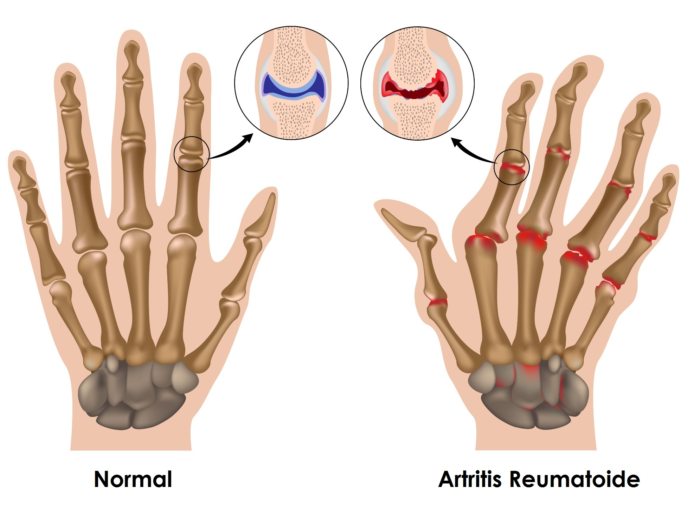

# 🧬 Fundamentos de Biodiseño

Este proyecto forma parte del curso **Fundamentos de Biodiseño** del grupo 11.  
A continuación, se presentan los integrantes del equipo de trabajo.

---

##  Integrantes

- **Goran Acurio Cabrera**  - goran.acurio@upch.pe
- **Gabriela Barrios** - gabriela.barrios@upch.pe
- **Jorge Briceño Hijar** - jorge.briceno@upch.pe
- **Marco Baltazar** - marco.baltazar@upch.pe
- **Camila Araujo** - camila.araujo@upch.pe
- **Katherin Berrio** - katherin.berrio@upch.pe

---

## Grupo de trabajo

| Grupo de trabajo|
|--------------|
|  |

---

## Temática

En este proyecto nos enfocamos en la artritis reumatoide.
|  |

## Problemática
La artritis reumatoide (AR) es una patología multifactorial autoinmune asociada con un proceso de inflamación crónico que afecta tanto articulaciones como órganos extrarticulares,[1] por lo que se considera una enfermedad sistemática. Asimismo, los síntomas del AR incluyen dolor, inflamación y rigidez en las articulaciones, las cuales al no ser tratadas en su debido tiempo, pueden generar deformación y limitación de movilidad afectando la calidad de vida de los pacientes.
## Justificación
A partir del análisis de varios estadísticos, se ha encontrado que la AR es un importante problema de salud pública. Debido a que, es la causa médica más común de pérdida de funcionalidad relacionada con la movilidad en los adultos en los Estados Unidos. Además, se ha encontrado que los costos de prevenir la AR mediante la reducción de factores de riesgo o tratamiento preventivo es mucho menor que los generados por la hospitalización y las cirugías.[1]
La artritis reumatoide afecta aproximadamente a 23,7 millones de personas a nivel mundial, es decir, entre el 0.5% y 1% de la población mundial. [2]

La artritis reumatoide afecta aproximadamente a 23,7 millones de personas a nivel mundial
## Referencias
[1] A. Radu y S. Bungau, "Management of Rheumatoid Arthritis: An Overview", September. 2021, Cells, 10(11), 2857; https://doi.org/10.3390/cells10112857
[2] D. Blanco, “Cambio de paradigma: el salto cuántico de la artritis reumatoidea, de las sales de oro y los tratamientos biológicos hasta las moléculas ‘de bajo peso,’” Infobae, Nov. 25, 2019. [Online]. Available: https://www.infobae.com/salud/2019/11/25/cambio-de-paradigma-el-salto-cuantico-de-la-artritis-reumatoidea-de-las-sales-de-oro-a-los-tratamientos-biologicos-hasta-las-moleculas-de-bajo-peso/#:~:text=Se%20estima%20que%20la%20AR%20afecta%20a,(0%2C6%20para%20varones%20y%203%2C2%20para%20mujeres).
