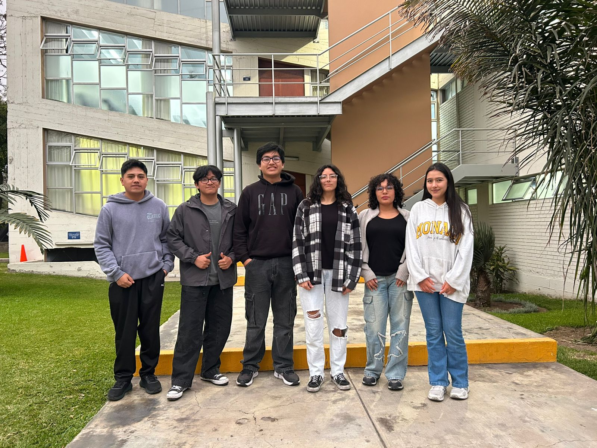
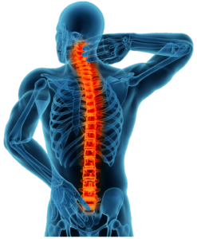
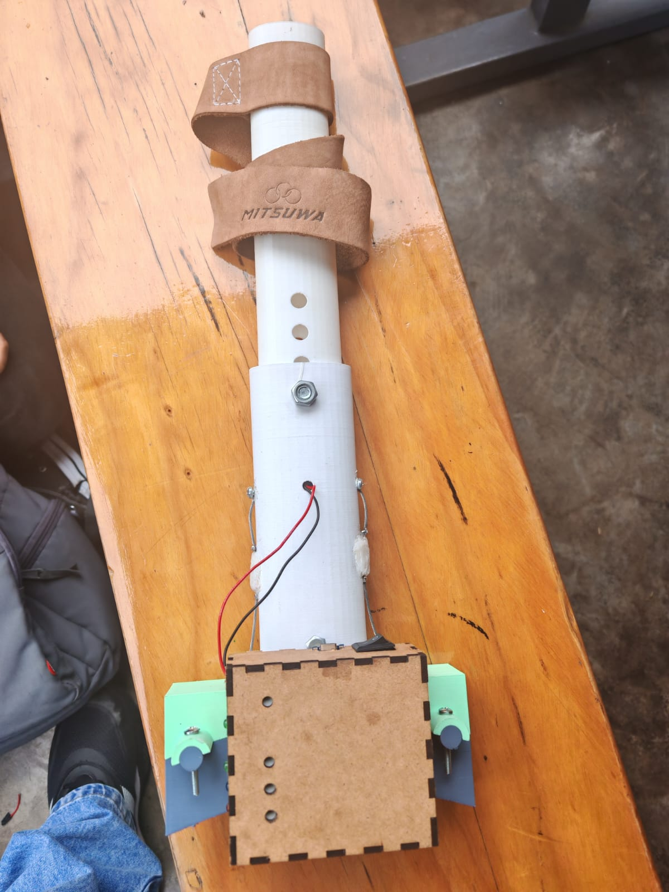

# 🧬 Fundamentos de Biodiseño

Este proyecto forma parte del curso **Fundamentos de Biodiseño** del grupo 11.  
A continuación, se presentan los integrantes del equipo de trabajo.

---

##  Integrantes

- **Goran Acurio Cabrera**  - goran.acurio@upch.pe
- **Gabriela Barrios** - gabriela.barrios@upch.pe
- **Jorge Briceño Hijar** - jorge.briceno@upch.pe
- **Marco Baltazar** - marco.baltazar@upch.pe
- **Camila Araujo** - camila.araujo@upch.pe
- **Katherin Berrio** - katherin.berrio@upch.pe

---

## Grupo de trabajo

| Grupo de trabajo|
|--------------|
|  |

---

## Temática

En este proyecto nos enfocamos en proporcionar una alternativa de movimiento en silla de ruedas para usuarios con lesiones medulares que cuentan con movilidad parcial en las extremidades superiores
|  |

## Problemática
El usuario sufrió una lesión medular C4 incompleta tipo C como producto de un accidente automovilístico. A raíz de esta lesión  la movilidad del paciente se encuentra comprometida, dependiendo completamente de una silla de ruedas para desplazarse. Sus extremidades inferiores no tienen rango de movilidad alguna, sin embargo tiene cierto rango de movimiento en sus brazos, lo que llevó a pensar que sería capaz de remar su silla de ruedas, sin embargo al no poder cerrar los dedos de las manos ni poder retraer completamente los brazos se le hizo imposible, por lo que ahora depende completamente de sus cuidadora principal.
## Justificación
Las sillas de ruedas convencionales son ampliamente utilizadas gracias a su bajo costo, disponibilidad y accesibilidad. Sin embargo, existen usuarios con limitaciones en su capacidad motora que requieren asistencia para desplazarse perdiendo su autonomía y desarrollo en actividades cotidianas.
El esfuerzo físico requerido para propulsar una silla mecánica puede resultar excesivo y puede llegar a generar fatiga muscular, lesiones por el sobreuso y desgaste prematuro en articulaciones; muestra de esto es el hecho de que, entre 31-73% de la población con lesiones en la médula espinal reportan dolor de hombro, muchas veces crónico [1]. A ello se le suma la necesidad recurrente de un acompañante, lo que restringe la independencia del usuario y limita su integración plena en la sociedad. 
En el caso específico de nuestro paciente, su limitada movilidad y fuerza en los brazos hace casi imposible el buen manejo de su silla de ruedas, necesidad en la cual nos enfocaremos.
En tal sentido, es necesario buscar alternativas para las sillas de ruedas convencionales, ya que en el mercado ya existen dispositivos motorizados; sin embargo, suelen implicar un costo elevado, dificultades en el mantenimiento y poca adaptabilidad a contextos con recursos limitados.
## Solución
Sistema de propulsión asistida basada en una palanca conectada al sobrearo de la silla de reudas.
|  |

## Referencias
[1] A. Liampas, P. Neophytou, M. Sokratous, G. Varrassi, C. Ioannou, G. M. Hadjigeorgiou, and P. Zis, “Musculoskeletal Pain Due to Wheelchair Use: A Systematic Review and Meta-Analysis,” Pain Ther., vol. 10, no. 2, pp. 973–984, Dec. 2021, doi: 10.1007/s40122-021-00294-5. 
